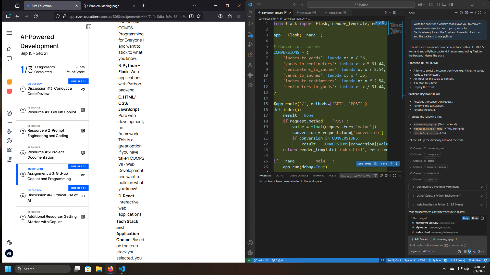
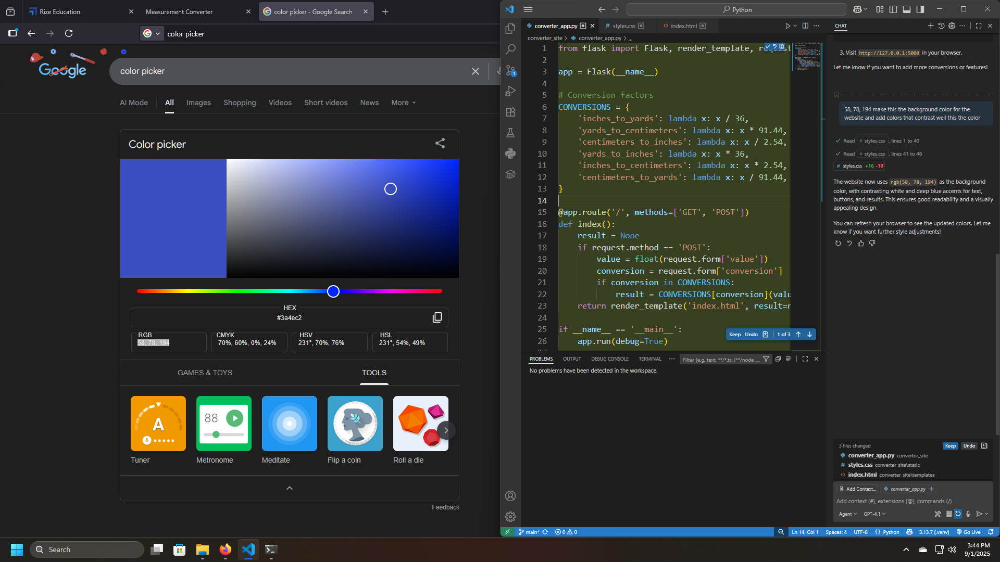
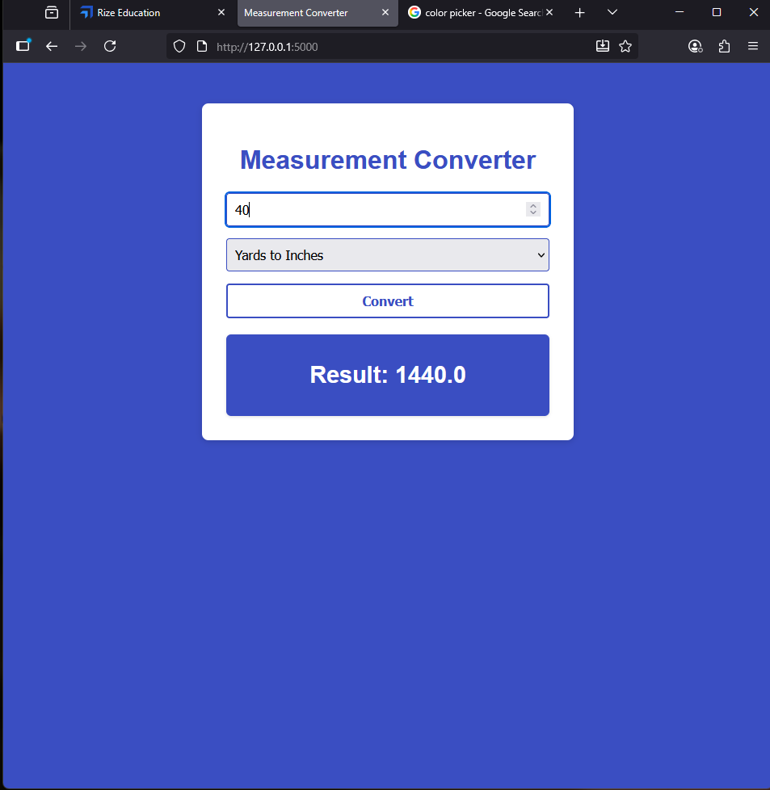
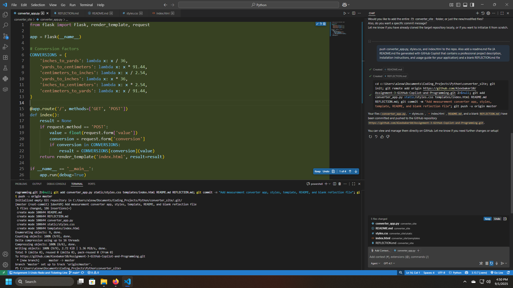

1. I asked Copilot to help me create a website that would convert measurements into different measurements. For example turning yards into inches. I broke it down by asking the front end of the 
website to be built using HTML and CSS because I am familiar with those 2 coding languages. On the backend I asked it to us Python and it used Flask which I am not familar with but Python I am.

2. I asked it a very broad question to begin with and then ask more specific questions as I went on. For example after the website was build I asked it to change the background color to match what I liked

4. The part that suprised me the most was just how useful Copilot was with the coding proces. Not only did it create all the files and download all the stuff it needed, I was also able to ask it to push the code
to my repository for me. I wasn't expecting this level for depth for a AI coding assistant.

6. Since Copilot knows so much the python code is very streamlined. I noticed it using a lambda function with I have no experience with. I looked it up and learned about its one-time use which helps with having to come up with
names for functions that will only be used once. Instead you can just use lambda to make the code less confusing.
7. If I had to build this again I would take it more slowly. I feel like I rushed the first part of the assignment to fast.

